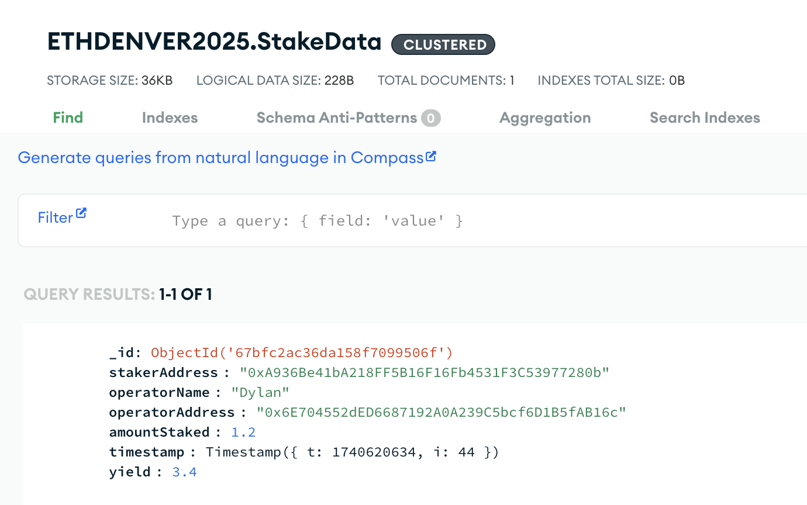

# Eigen Games 2025: EigenHealth 🏥 👨‍⚕️ 👩‍⚕️

### By Amit Krishnaiyer and Dylan Subramanian from the University of Illinois Urbana-Champaign

### Tags: #healthcare, #artificial_intelligence, #avs, #web3abstraction

### Background (Sampson vs. HeartWise Health Systems Corporation (2023))

As society becomes increasingly intertwined with AI in 2025, hospitals strive to use AI/ML models to provide state-of-the-art care to their patients. Hospitals have many tools to choose from, and lives are at stake when hospitals make a decision. There unfortuantely isn't much accountability when an AI company makes a claim versus how the model actually performs, and this has led to some serious issues. Most notably, **Sampson v. HeartWise Health Systems Corporation (2023)** is the case regarding 29 year old Joshua Sampson. He went to Isaac Health for cardiac screening, where they used HeartWise Health Systems Corporation's AI screening software which didn't detect any problems with Joshua's heart. A few weeks later, Joshua died from arrhythmia, and the court found not HeartWise Health Systems Corporation which developed the model, but Isaac Health, liable for a wrongful death action. It also turned out that the model was trained and upheld accuracy claims for those above 50 years ago, which wasn't clear to Isaac Health at the time. 

#### Thus, EigenHealth comes in to increase the transparency between hospitals and the biotech companies building these AI models. 

### What is EigenHealth?

EigenHealth is an application for hospitals and clinic to get reliable benchmarks on biotech companies that offer AI Models. We use AVS as a service (using Othentic stack) to help validate that a healthcare model is as accurate as it claims, as well as verifying more nuanced details on which groups the AI model performs stronger on. The hospital simply puts in the AI model and the benchmark test, and once the results are validated through the AVS, the hospital can analyze its performance against other models on our leaderboard and make a more informed decision on which model to move forward with in its practice. 

Additionally, we also have a page for stakers who want to delegate their tokens to operators to help further secure the network (using P2P API). 

### What is the future of EigenHealth?

We are both interested in continuing to build EigenHealth, as we believe this is a strong use case that has an impact on everyone who recieves care from a hospital. 

1) One of our big visions is **web3 abstraction** for the hospitals. Hospitals pay a subscription fee in USD, and under the hood that fee is used for staking rewards for the operators powering the AVS that secures our system. In other words, the way EigenHealth calculates benchmark results for AI models is abstracted away from the hospitals, but they can be assured that these results are accurate and secure as they are leveraged from the underlying AVS system.

2) We would also like to offer more flexibility in benchmarks results of a given model. For example, hospitals should also be able to group model performance into buckets such as gender and age. This is because some hospitals/clincs may specialize on patients of a specific demographic/background, so this feature will help further personalize models to hospitals.

3) We would also like to build a protocol that enforces stakers to distribuite staking rewards fairly amonst delegators, similar to a model like **Rocket Pool**

### EigenHealth Technical Stack

Next.js/Javascript: Frontend

MongoDB: (**backend_mongodb**) to store staker data and benchmark data, as the Holesky ETH network was currently down during the duration of this hackathon

Flask/Python: We used a python flask server (**benchmark_backend**) for operators to run benchmark testing

Othentic: the (**ai_benchmark_avs**) folder leveraged Othentic's stack to verify model results and reach consensus amonst operators

P2P: (**p2p_backend**) also runs to automate the process of delegators giving tokens to the staker, and the process of the staker staking and restaking the tokens using the P2P API

AWS: Storing larger AI model/benchmark files for our Operators to pull and use.

### EigenHealth P2P Integration

From the frontend (DelegateInput component), the user delegates the ETH specified to a contract. Once that ETH is delegated and the amount in the contract reaches >32 ETH, the countract balance is autoamtically sent to the owner (staker), and the reportWithdrawal.js code in p2p_backend automatically handles the process of staking and restaking to the proper Operator on behalf of the staker. In the future, we will implement a contract that fairly distribuites the staking rewards to all delegators. Note that the HoleskyDeposit contract that stores the funds for the staker is also in the p2p_backend folder.

Since the Holesky network is down, we switched our implementation for our demo. Instead of delegators delegating ETH to the contract first, stakers use the delegate button to directly fund the operator of their choice. So the frontend doesn't route to the code in p2p_backend, rather in the DelegateInput component in the frontend, the API call is made directly to stake to the network, and the user recieves a transaction Hash to confirm this. We also use MongoDb to mock the delegation results shown in the demo. 

### EigenHealth Othentic Integration

The **ai_benchmark_avs** contains all of our AVS logic using the Othentic stack. The performer first recieves a get request from the frontend with model and benchmark parameters. The performer then contacts the benchmark_backend in python with these parameters, and the benchmark_backend pulls the necessary files from AWS and gets the results for the performer. The operators in the system performs the exact same process, and if their accuracy/confusion matrix is within a statistically significant threshold of the origin performer, the operation is approved. The aggregator then puts the transactionHash on polyscan, and our frontend uses the data stored in the transaction to display results to the user. We deployed our AVS on Holesky L1 and Polygon Amoy L2. 

